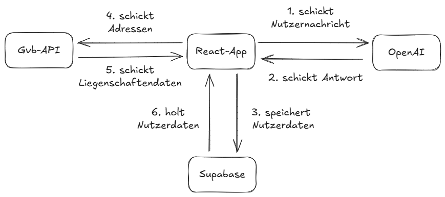

# PrevenTect

## Projektinformationen

**Anwendung ist deployt**: http://13.60.92.130:8080/

## Video-Demo
[▶ Video-Demo ansehen (MP4)](./dokumentation/baernHaeckt25_taffeGiraffe_gvb_prevenTect_ohneVoice_compressed.mp4)

**Anwendung lokal starten**
Wenn du das Projekt lokal mit deiner eigenen IDE bearbeiten möchtest, gehe wie folgt vor:

```sh
# Schritt 1: Klone das Repository mit der Git-URL des Projekts.
git clone <YOUR_GIT_URL>

# Schritt 2: Wechsle in das Projektverzeichnis.
cd <YOUR_PROJECT_NAME>

# Schritt 3: Installiere die benötigten Abhängigkeiten.
npm i

# Schritt 4: Starte den Entwicklungsserver mit Auto-Reload und Instant-Preview.
npm run dev
```

Erforderlich sind lediglich eine installierte Node.js- und npm-Umgebung sowie API-Schlüssel für Mapbox und OpenAI.

## Ausgangslage

### Worauf habt ihr euch fokussiert?

Unser Ziel war es, einen Mehrwert sowohl für die GVB als auch für deren Kunden zu schaffen.

Für die Kunden sollen die Schadenspräventationsmassnahmen klarer und nachvollziehbarer dargestellt werden. Zum einen wird der Mehrwert, den die GVB ihren Kunden bietet, deutlich sichtbarer aufgezeigt. Zum anderen profitieren die Liegenschaftsbesitzer selbst davon, da sie bestehende Schwachstellen an ihren Gebäuden besser erkennen können. So wird beispielsweise aufgezeigt, dass eine provisorische Lösung wie das Abdecken eines Pools mit Plexiglas, bei wiederkehrenden Sturmschäden keine nachhaltige Massnahme ist und durch eine geeignete Alternative ersetzt werden sollte.

Für die GVB besteht der Nutzen darin, dass die Liegenschaften auf der Karte markiert werden können z. Bsp. wenn sie von Hochwasserereignissen oder Sturm- und Hagelrisiken betroffen sind. Aber auch Liegenschaften, die schon einmal eine Schadensmeldung gemacht haben. Damit wird ein schnelles Monitoring und eine transparente Kommunikation ermöglicht.

### Welche technischen Grundsatzentscheide habt ihr gefällt?

Wir haben folgende technische Grundsätze gefällt:

- **Frontend-first Ansatz**: Die Visualisierung der Daten stand im Zentrum

- **Integration statt Replikation**: Wir nutzen bestehenden Datenquellen der GVB, statt redundante Datensilos aufzubauen

- **Interaktive Kartenansicht**: Der Kunde kann seine Geolocation angeben für die Risikodarstellung

## Technischer Aufbau



### Welche Komponenten und Frameworks habt ihr verwendet und wozu und wie werden diese eingesetzt?

- **React**: Library, für die Frontend-Entwicklung, um eine performante und modulare Web-App zu erstellen

- **Tailwind CSS**: Auch eine Library, für ein konsistentes Design

- **Mapbox**: zur Darstellung der Gebäude und Liegenschaften auf interaktiven Karten

- **Shadcn**: Als UI-Komponentenbibliothek, um einheitliche und ansprechende Oberflächen bereitzustellen

- **OpenAI**: Die API wurde hier genutzt für den Chatbot

- **Superbase**: BaaS um die Kundendaten abzuspeichern

- **AWS**: Deployment und Hosting der Anwendung

- **AI Copilot (lovable.ai)**: zur Unterstützung bei der Entwicklung und Codegenerierung


## Implementation

### Gibt es etwas Spezielles, was ihr zur Implementation erwähnen wollt?

Wir haben die API genutzt, die uns GVB gegeben hat. Auch brauchen wir für unsere Lösung zwei weitere API Keys, eine für Map Box und eine für Open AI 

Was ist aus technischer Sicht besonders cool an eurer Lösung?

Hoher Visualisierungsgrad: Risiken sind auf einen Blick sichtbar, statt in Tabellen versteckt zu sein.
Einfache Deploybarkeit: Durch die gewählte Architektur kann die Lösung einfach erweitert oder in bestehende Systeme integriert werden (die Umsetzung bei uns folgte auf AWS).

## Abgrenzung / Offene Punkte

### Welche Abgrenzungen habt ihr bewusst vorgenommen und damit nicht implementiert? Weshalb?

Wir haben Geodaten zur Geolocation genutzt, die nicht direkt von der GVB stammen. Von der GVB haben wir Hochwasser/Fliessgewässerdaten sowie Sturmdaten genutzt.
Wir haben uns auf wenige, qualitativ hochwertige Daten konzentriert, um die Machbarkeit des Prototyps zu demonstrieren.

### Offene Punkte:
Mit mehr Zeit und einer vertieften Ausarbeitung wäre es zudem denkbar, auch die Materialbeschaffenheit der Liegenschaften in die Analyse zu integrieren, um die Risikoeinschätzung noch präziser und praxisnäher zu gestalten

Die technische Dokumentation lässt sich auch noch hier finden:

[Technische Dokumentation (DOCX)](./dokumentation/BernHackt_Tech%20Jury%20Documentation_Taffe%20Giraffen.docx)